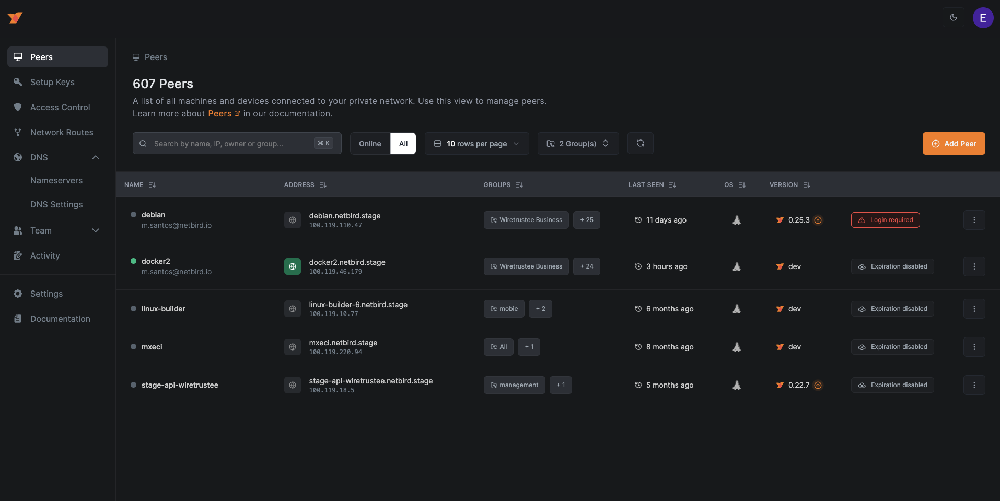
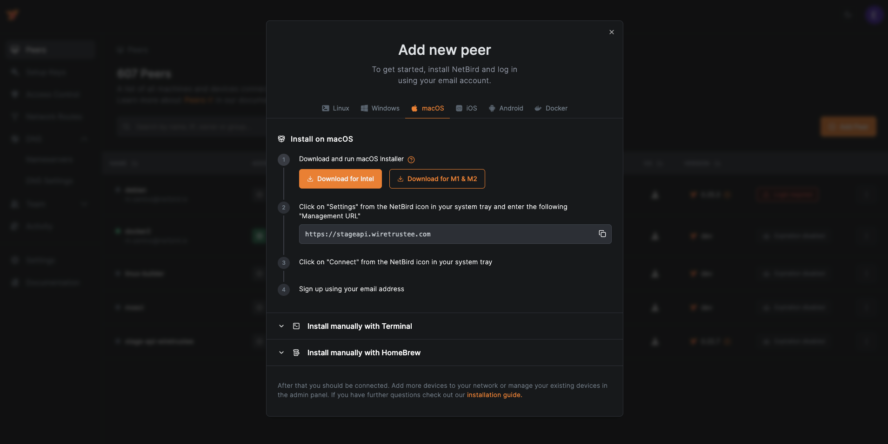

# NetBird Dashboard

This project is the UI for NetBird's Management service.

**Hosted version:** https://app.netbird.io/

See [NetBird repo](https://github.com/netbirdio/netbird)

## Why?

The purpose of this project is simple - make it easy to manage VPN built with [NetBird](https://github.com/netbirdio/netbird).
The dashboard makes it possible to:
- track the status of your peers
- remove peers
- manage Setup Keys (to authenticate new peers)
- list users
- define access controls

## Some Screenshots




## Technologies Used

- NextJS
- ReactJS
- Tailwind CSS
- Auth0
- Nginx
- Docker
- Let's Encrypt

## How to run
Disclaimer. We believe that proper user management system is not a trivial task and requires quite some effort to make it right. Therefore we decided to
use Auth0 service that covers all our needs (user management, social login, JTW for the management API).
Auth0 so far is the only 3rd party dependency that can't be really self-hosted.

1. Install [Docker](https://docs.docker.com/get-docker/)
2. Register [Auth0](https://auth0.com/) account
3. Running NetBird UI Dashboard requires the following Auth0 environmental variables to be set (see docker command below):

   `AUTH0_DOMAIN` `AUTH0_CLIENT_ID` `AUTH0_AUDIENCE`

   To obtain these, please use [Auth0 React SDK Guide](https://auth0.com/docs/quickstart/spa/react/01-login#configure-auth0) up until "Configure Allowed Web Origins"

4. NetBird UI Dashboard uses NetBirds Management Service HTTP API, so setting `NETBIRD_MGMT_API_ENDPOINT` is required. Most likely it will be `http://localhost:33071` if you are hosting Management API on the same server.
5. Run docker container without SSL (Let's Encrypt):

   ```shell
   docker run -d --name netbird-dashboard \
     --rm -p 80:80 -p 443:443 \
     -e AUTH0_DOMAIN=<SET YOUR AUTH DOMAIN> \
     -e AUTH0_CLIENT_ID=<SET YOUR CLIENT ID> \
     -e AUTH0_AUDIENCE=<SET YOUR AUDIENCE> \
     -e NETBIRD_MGMT_API_ENDPOINT=<SET YOUR MANAGEMETN API URL> \
     netbirdio/dashboard:main
   ```
6. Run docker container with SSL (Let's Encrypt):

   ```shell
   docker run -d --name netbird-dashboard \
     --rm -p 80:80 -p 443:443 \
     -e NGINX_SSL_PORT=443 \
     -e LETSENCRYPT_DOMAIN=<YOUR PUBLIC DOMAIN> \
     -e LETSENCRYPT_EMAIL=<YOUR EMAIL> \
     -e AUTH0_DOMAIN=<SET YOUR AUTH DOMAIN> \
     -e AUTH0_CLIENT_ID=<SET YOUR CLEITN ID> \
     -e AUTH0_AUDIENCE=<SET YOUR AUDIENCE> \
     -e NETBIRD_MGMT_API_ENDPOINT=<SET YOUR MANAGEMETN API URL> \
     netbirdio/dashboard:main
   ```

## How to run local development

1. Install [Node](https://nodejs.org/)
2. Create and update the `.local-config.json` file. This file should contain values to be replaced from `config.json`
3. Run `npm install` to install dependencies
4. Run `npm run dev` to start the development server

Open [http://localhost:3000](http://localhost:3000) with your browser to see the result.

You can start editing by modifying the code inside `src/..`  
The page auto-updates as you edit the file.

## How to migrate from old dashboard (v1) 

The new dashboard comes with a new docker image `netbirdio/dashboard:main`.  
To migrate from the old dashboard (v1) `wiretrustee/dashboard:main` to the new one, please follow the steps below.

1. Stop the dashboard container `docker compose down dashboard`
2. Replace the docker image name in your `docker-compose.yml` with `netbirdio/dashboard:main`
3. Recreate the dashboard container `docker compose up -d --force-recreate dashboard`