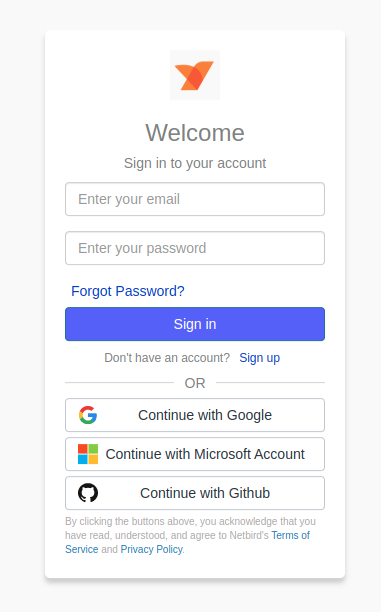
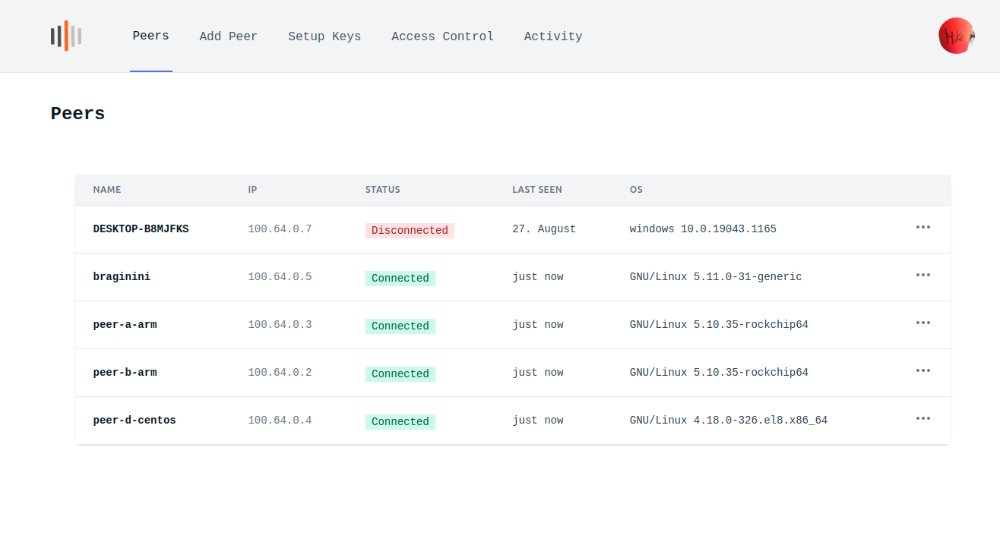
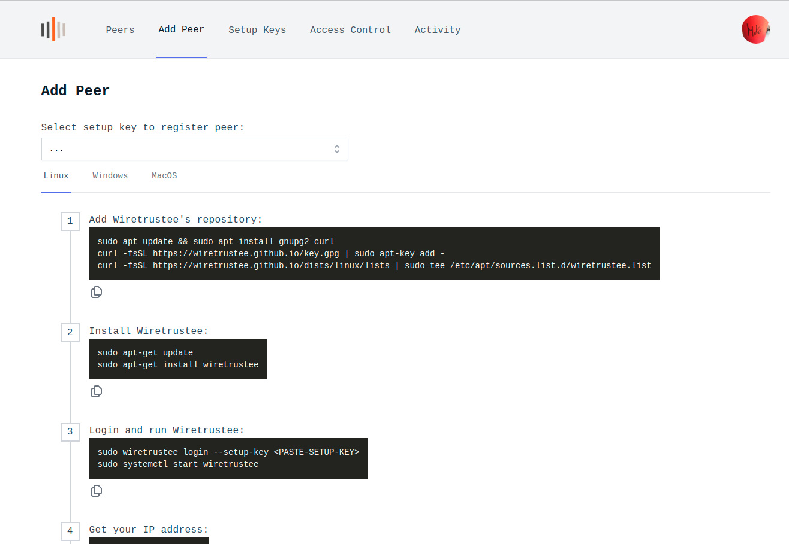

# netbird dashboard

### Big News! Wiretrustee becomes `netbird`. [See details](https://blog.wiretrustee.com).
\
This project is the UI for netbird's management service. 

**Hosted demo version:** https://app.netbird.io/

See [netbird repo](https://github.com/netbirdio/netbird)

## Why UI dashboard is needed?

The purpose of this project is simple - make it easy to manage VPN built with [netbird](https://github.com/netbirdio/netbird).
The dashboard makes it possible to:
- track the status of your peers
- remove Peers
- manage Setup Keys (to authenticate new peers)
- monitor system activity (coming soon)
- manage peer access (coming soon)

## Some Screenshots





## Technologies Used

- ReactJS
- Tailwind CSS. We are using paid License of [TailwindUI](https://tailwindui.com/)
- Auth0
- Nginx 
- Docker
- Letsencrypt

## How to run
Disclaimer. We believe that proper user management system is not a trivial task and requires quite some effort to make it right. Therefore we decided to
use Auth0 service that covers all our needs (user management, social login, JTW for the management API).
Auth0 so far is the only 3rd party dependency that can't be really self-hosted.

1. install [Docker](https://docs.docker.com/get-docker/)
2. register [Auth0](https://auth0.com/) account
3. running Wiretrustee UI Dashboard requires the following Auth0 environmental variables to be set (see docker command below): 

      ```AUTH0_DOMAIN``` ```AUTH0_CLIENT_ID``` ```AUTH0_AUDIENCE```
      
      To obtain these, please use [Auth0 React SDK Guide](https://auth0.com/docs/quickstart/spa/react/01-login#configure-auth0) up until "Configure Allowed Web Origins"

4. Wiretrustee UI Dashboard uses Wiretrustee Management Service HTTP API, so setting ```WIRETRUSTEE_MGMT_API_ENDPOINT``` is required. Most likely it will be ```http://localhost:33071``` if you are hosting Management API on the same server.
5. Run docker container without SSL (Let's Encrypt):
   
   ```docker run -d --name wiretrustee-dashboard --rm -p 80:80 -p 443:443  -e AUTH0_DOMAIN=<SET YOUR AUTH DOMAIN> -e AUTH0_CLIENT_ID=<SET YOUR CLIENT ID> -e AUTH0_AUDIENCE=<SET YOUR AUDIENCE> -e  WIRETRUSTEE_MGMT_API_ENDPOINT=<SET YOUR MANAGEMETN API URL> wiretrustee/dashboard:main```
6. Run docker container with SSL (Let's Encrypt):
   
   ```docker run -d --name wiretrustee-dashboard --rm -p 80:80 -p 443:443 -e NGINX_SSL_PORT=443 -e LETSENCRYPT_DOMAIN=<YOUR PUBLIC DOMAIN> -e LETSENCRYPT_EMAIL=<YOUR EMAIL>  -e AUTH0_DOMAIN=<SET YOUR AUTH DOMAIN> -e AUTH0_CLIENT_ID=<SET YOUR CLEITN ID> -e AUTH0_AUDIENCE=<SET YOUR AUDIENCE> -e  WIRETRUSTEE_MGMT_API_ENDPOINT=<SET YOUR MANAGEMETN API URL> wiretrustee/dashboard:main```

## How to run local development
1. Install node 16
2. create and update the src/.local-config.json file. This file should contain values to be replaced from src/config.json
3. run `npm install`
4. run `npm run start dev`